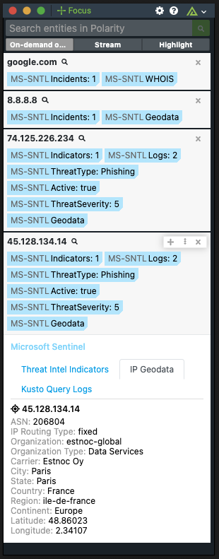

# Polarity Microsoft 365 Defender Integration

TODO

  TODO
  

To learn more about Microsoft 365 Defender, visit the [official website](__TODO__).

## Microsoft 365 Defender Integration Options
TODO
### Azure AD Registered App Client/Application ID
Your Azure AD Registered App's Client ID associated with your Microsoft 365 Defender Instance.

### Azure AD Registered App Tenant/Directory ID
Your Azure AD Registered App's Tenant ID associated with your Microsoft 365 Defender Instance.

### Azure AD Registered App Client Secret
Your Azure AD Registered App's Client Secret associated with your Microsoft 365 Defender Instance.

### Kusto Query String
Kusto Query String to execute on the 365 Defender Log Analytics Workspace. 
The string `{{ENTITY}}` will be replace by the looked up Entity. 
For example: ThreatIntelligenceIndicator | search "{{ENTITY}}" | take 10

### Kusto Query Summary Fields
Comma delimited list of field values to include as part of the summary.  
These fields must be returned by your Kusto Query to appear in the Summary Tags. 
This option must be set to "User can view and edit" or "User can view only"

### Kusto Query Ignore Fields
Comma delimited list of Fields to ignore from the Kusto Query Results in the Overlay. 
This option must be set to "User can view and edit" or "User can view only".

### Lookback Days
The number of days to look back when querying logs, and incidents.

## Installation Instructions

Installation instructions for integrations are provided on the [PolarityIO GitHub Page](https://polarityio.github.io/).

## Polarity

Polarity is a memory-augmentation platform that improves and accelerates analyst decision making.  For more information about the Polarity platform please see:

https://polarity.io/
